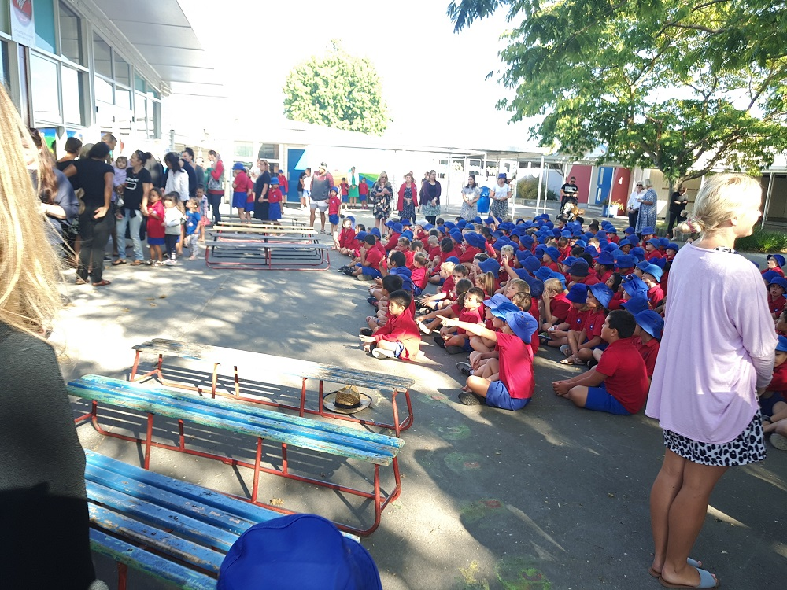

There is a "Preface" at Terry's school today. I drove him to the school and attended the "Preface".

In the Preface, we felt welcome and pleased to be here. After a presentation in Maori, a quote in English was been spoken. It gave me solemn feelings.

All the kids sit down on the ground and listen patiently and properly. Later on, all children stood up and sang a maori song. Then we were lead to student hall and were been fed with delicious snacks.

There were two girls from Terry's class there to cater us. They did really good job. Terry told me one of them is his friend.

To Be Better Than Before! This is a motto from the Bledisloe School. I believe Terry will be better version in here!

